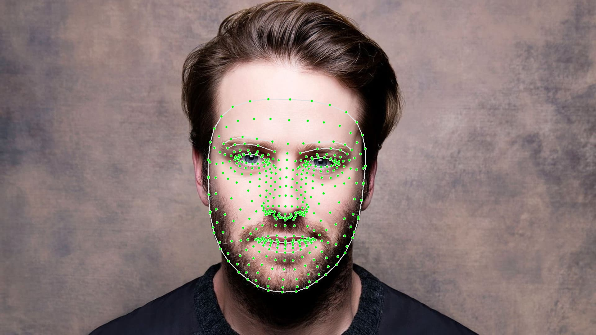

# Face Mesh Detector

This repository implements face mesh detection using **OpenCV** and **MediaPipe**. It processes images and videos to detect and draw a mesh of 468 landmarks on human faces. This can be useful in various applications such as face tracking, augmented reality (AR), and 3D facial analysis.

## Project Structure

```plaintext
Images/                     # Folder containing sample images
    img_lm2.jpg              # Example image showing face mesh
FaceMeshModule.py            # Python module for face mesh detection
README.md                    # This README file
Test_Image.py                # Script to run face mesh on an image
Test_Video.py                # Script to run face mesh on a video
requirements.txt             # List of dependencies
```

## Installation

To run this application, you need to have Python 3 and the necessary libraries installed. You can install the required dependencies using `pip` but first clone this repository by the following command.

```bash
git clone https://github.com/BehzadHassan/face-mesh-detector.git
```

Then install all the dependencies using:

```bash
pip install -r requirements.txt
```
**FaceMeshModule.py** is the main module that will be used to build the face mesh. It will automatically detect the faces in given image of video and draw the mesh accordingly, also it returns the facial landmarks. To use this Module here are two more files **Test_Image.py** and **Test_Video.py**

## Usage

1. **Face Mesh on an Image**  
   To run face mesh detection on an image, use the `Test_Image.py` script. But first provide the path to the image you want to analyze:
   
   ```python
   img = cv2.imread("./Path_to_image")
   # Here provide the path to the image
    ```
2. **Face Mesh on a Video**  
   To run face mesh detection on a video, use the `Test_Video.py` script. But first, provide the path to the video file you want to analyze:
   
   ```python
   cap = cv2.VideoCapture("./Path_to_video")
   # Here provide the path to the video
    ```

## Face Mesh Example

Below is an example of how the face mesh appears when applied to a face in an image:



### Explanation of Face Mesh

The face mesh consists of **468 3D landmarks** that map out the facial structure. Each landmark corresponds to a specific point on the face, allowing for high-precision facial feature detection. 

#### Applications of Face Mesh:
- **Facial Expression Recognition**: Capture subtle expressions for applications in animation and psychology.
- **Augmented Reality**: Integrate virtual elements with real faces in applications like face filters and gaming.
- **3D Face Reconstruction**: Create detailed 3D models of faces for medical and gaming applications.
- **Face Alignment**: Use for enhancing recognition systems and improving accuracy.

The face mesh is a powerful tool for any application that requires detailed understanding and interaction with human facial features.
## Conclusion

This Face Mesh Detector project showcases the capabilities of OpenCV and MediaPipe for real-time face landmark detection. With the detailed facial mesh, you can explore various applications in fields such as augmented reality, facial recognition, and animation.

### Contributions

We welcome contributions to enhance this project further! If you have ideas, improvements, or bug fixes, feel free to submit a pull request or open an issue.

### Contact

For any questions or feedback, please reach out to me at [behzadhassan967@gmail.com](mailto:behzadhassan967@gmail.com).

